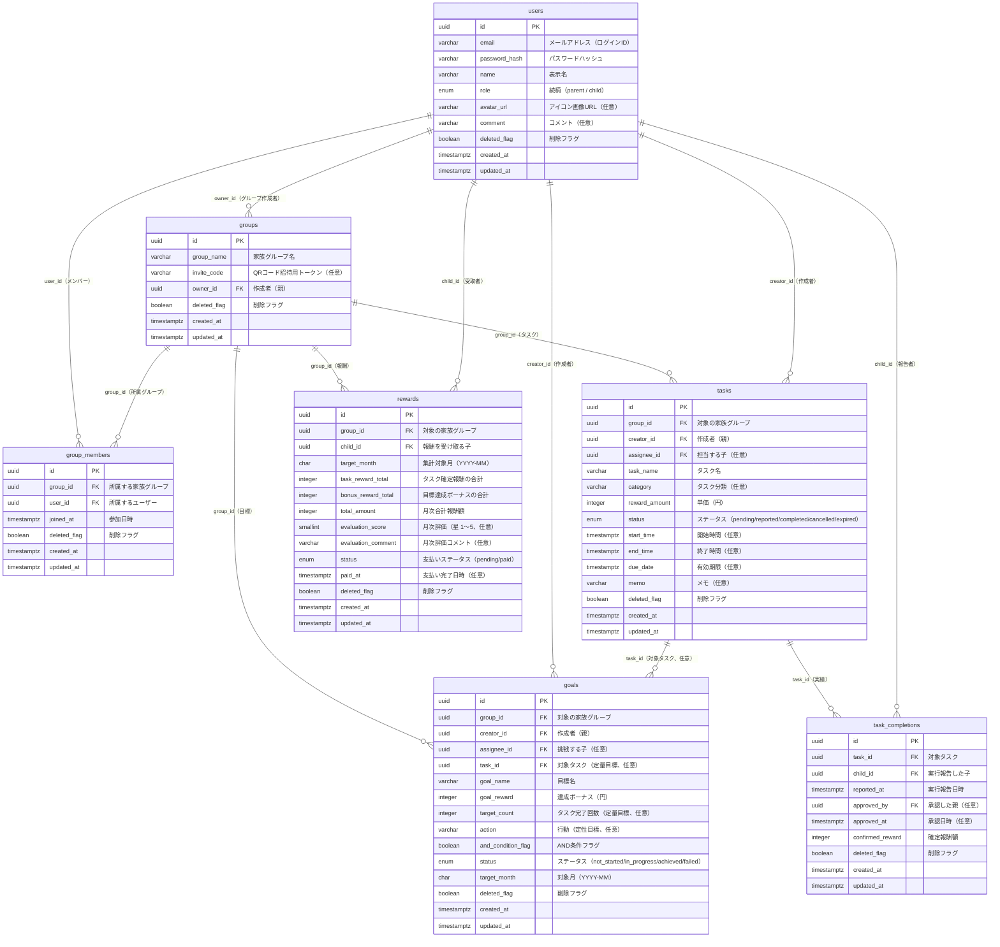

# ER 図（FamBiz）

## 概要

FamBiz のデータベースを構成する全エンティティと、それらのリレーションを表した ER 図です。`schema.dbml`（プロトタイプ版 Supabase / PostgreSQL）をもとに作成しています。ステータス系のフィールドはマスタテーブルではなく Enum 型（PostgreSQL）で管理します。各エンティティには主キー（PK）と主要な外部キー（FK）を明示しています。

## 図

## Enum 定義

| Enum名 | 値 | 説明 |
|--------|-----|------|
| `user_role` | `parent` / `child` | ユーザーの続柄（親 / 子） |
| `task_status` | `pending` / `reported` / `completed` / `cancelled` / `expired` | タスクステータス（未対応 / 対応済 / 完了 / キャンセル済 / 期限切れ） |
| `goal_status` | `not_started` / `in_progress` / `achieved` / `failed` | 目標ステータス（未挑戦 / 挑戦中 / 達成済 / 未達成） |
| `reward_status` | `pending` / `paid` | 支払いステータス（未払い / 支払い完了） |

## 補足

- 全テーブルに論理削除用の `deleted_flag`（削除フラグ）を保持します。
- ユーザーの続柄（親／子）は `users.role` の Enum 型で管理し、JWTカスタムクレームにも含めます（ADR-0003 参照）。
- 家族グループとユーザーは `group_members` を介した多対多の中間テーブルで紐付きます。
- タスクの実行報告・承認記録は `task_completions` テーブルで管理します（子が誰が・いつ・いくら承認されたかを記録）。
- `tasks.assignee_id`（担当者）と `task_completions.approved_by`（承認者）は `users` への任意 FK であるため、ER 図では主要な関係（creator / child）のみ矢印で表示しています。
- 月次評価（星・コメント）は `rewards` テーブルに統合して管理します。
- 詳細なカラム定義・制約・インデックスは `docs/design/schema.dbml` を参照してください。
