# 目標登録・挑戦フロー（FamBiz）

## 概要

親による今月の目標（マンスリーゴール）の登録から、子の挑戦、月末の達成判定・承認までの業務フローを表したフローチャートです。目標は対象となるタスクに紐付けて設定され、定量目標（タスク完了回数）や定性目標（行動）として表現されます。子が挑戦し、月末に親が達成／未達成を判定し、達成時には目標報酬（ボーナス）が支払い完了処理で加算されます。本図は業務要件定義書「5.2 目標登録と目標挑戦フロー」および「6.5 目標設定（マンスリーゴール）に関するルール」に対応します。

## 図

```mermaid
flowchart LR
    Start([開始]) --> P1[親: 今月の目標を登録]
    P1 --> LINK[目標を対象タスクに紐付け<br/>完了回数 / 行動 / AND条件]
    LINK --> SAVE[(目標を保存)]
    SAVE --> ST1[ステータス: 未挑戦]

    ST1 --> C1[子: 目標を確認]
    C1 --> CH{挑戦する?}
    CH -- しない --> END1([終了])
    CH -- する --> C2[子: 目標に挑戦]
    C2 --> ST2[ステータス: 挑戦中]

    ST2 --> PROG[実績がタスク完了に応じて加算<br/>進捗率をプログレスバー表示]
    PROG --> P2[親: 月末に達成判定]
    P2 --> JUDGE{達成?}

    JUDGE -- 失敗 --> ST3[ステータス: 未達成]
    ST3 --> END2([終了])

    JUDGE -- 成功 --> ST_PA[ステータス: 承認待ち]
    ST_PA --> P3[親: 目標達成を承認]
    P3 --> ST4[ステータス: 達成済]
    ST4 --> BONUS[目標報酬（ボーナス）を加算<br/>支払い完了処理時]
    BONUS --> END3([終了])
```

## 補足

- 目標は「対象タスク」に紐付けて設定します（`schema.dbml` の `goals.task_id` → `tasks` の関連を参照）。
- 目標の種類は、定量目標（タスク完了回数）・定性目標（行動）から選択または組み合わせて設定でき、AND 条件フラグで複数条件の同時達成を要求できます。
- 進捗は月次ダッシュボードでプログレスバー等により可視化されます。
- 目標報酬（ボーナス）は通常のタスク報酬とは別に集計され、月末の「支払い完了」処理時に加算されます。
- ステータス（未挑戦／挑戦中／達成済／未達成）は `goal_status` Enum（`schema.dbml` 参照）で管理します。
