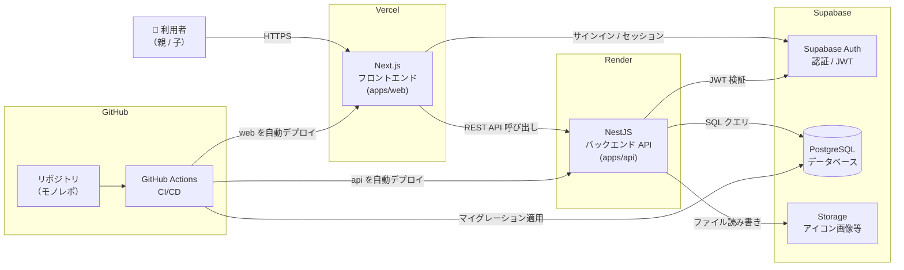

# インフラ構成図（FamBiz / プロトタイプ）

## 概要

FamBiz プロトタイプ版のインフラ構成を表した図です。フロントエンド（Next.js）を Vercel に、バックエンド（NestJS）を Render に、データベース・認証・ストレージを Supabase にホスティングします。いずれも GitHub 連携による自動デプロイ（CI/CD）を採用し、無料枠での迅速な公開を優先しています。矢印はサービス間の通信方向と役割を示します。本番版（AWS 構成）は本図のスコープ外です。

## 図

## 補足

- 通信はすべて HTTPS（TLS）で行います。
- 認証は Supabase Auth を採用し、発行された JWT をバックエンド（NestJS）側で検証してアクセス制御を行います。
- データベースは Supabase 上の PostgreSQL を利用し、`schema.dbml` から生成したマイグレーションを GitHub Actions 経由で適用します。
- 選定理由：Vercel は Next.js との親和性が高く、Render は多言語対応で Node.js を容易にデプロイでき、Supabase は RDB に加えて認証・ストレージを一体で備える点を評価して採用しています。いずれも無料枠で利用可能です。
- 本番版では AWS（ECS / RDS / ALB / Route 53 / S3 / SQS / SES・SNS / WAF など）への移行を想定していますが、本図はプロトタイプ構成のみを対象としています。
