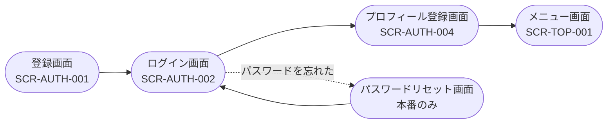
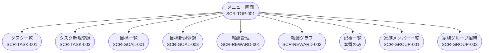
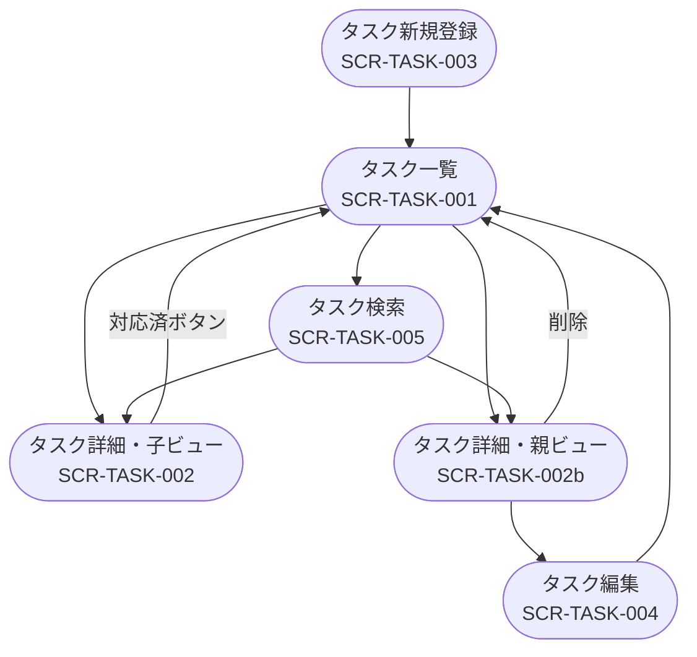
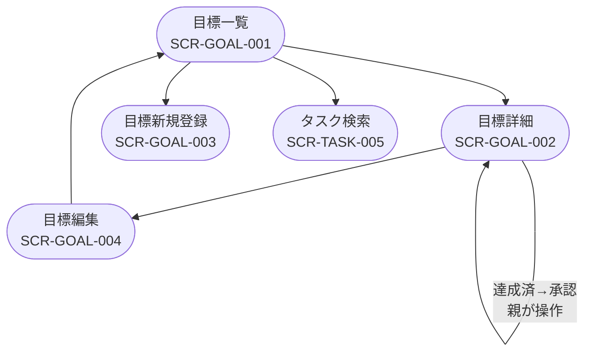
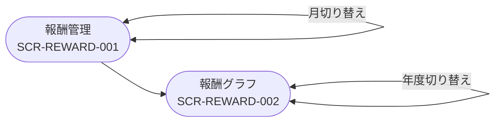
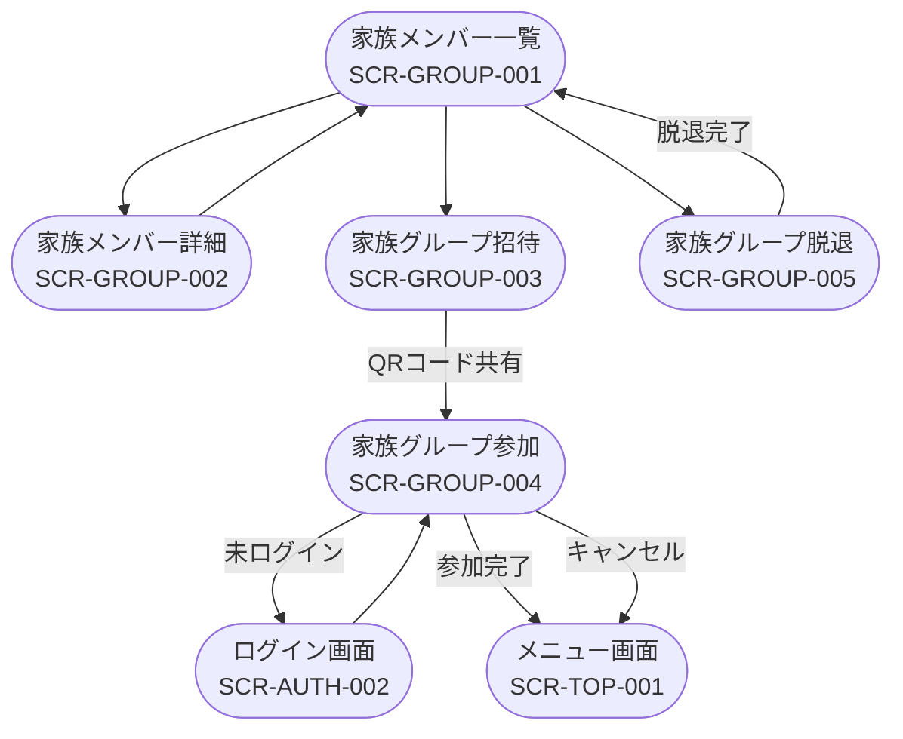
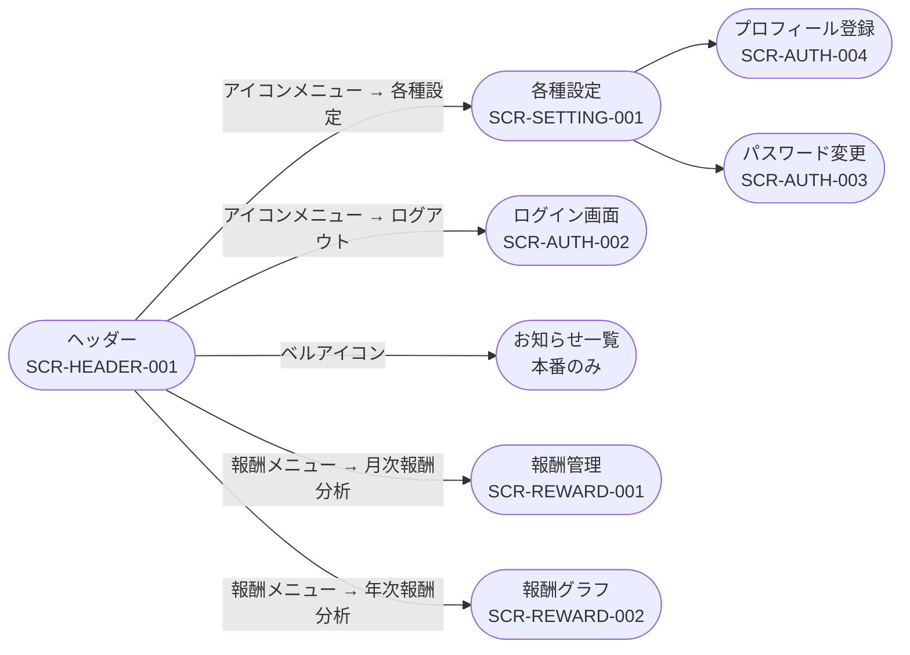
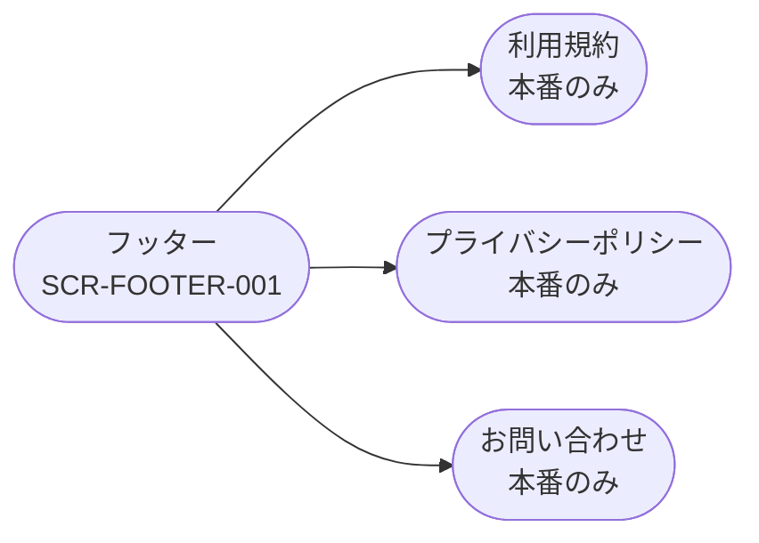
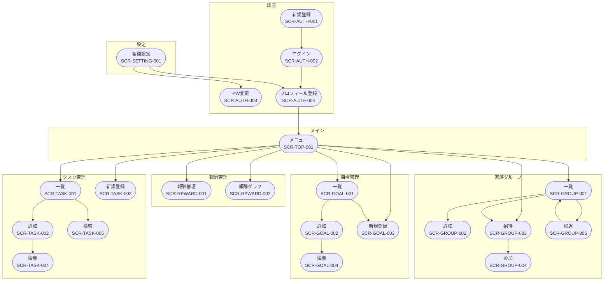

# FamBiz 画面遷移図

- システム名：FamBiz
- 対象バージョン：プロトタイプ版（MVP）
- 最終更新日：2026-05-22
- 記法：Mermaid flowchart

> 凡例
> - 青枠：プロトタイプ対象画面
> - 赤枠（本番のみ）：本番版のみ対象
> - 破線矢印：条件分岐による遷移

---

## 1. 新規登録フロー

---

## 2. TOPページ（メニュー画面）からの遷移

---

## 3. タスク管理フロー

---

## 4. 目標管理フロー

---

## 5. 報酬管理フロー

---

## 6. 家族グループ管理フロー

---

## 7. ヘッダーからの遷移

---

## 8. フッターからの遷移

---

## 9. 全体遷移サマリー

