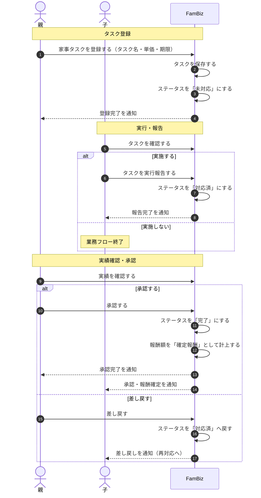

# タスク実行フロー（FamBiz）

## 概要

家事タスクの登録から実行報告、承認、完了までの一連の業務フローをシーケンス図で表したものです。親がタスクを登録するとステータスは「未対応」となり、子が実行報告すると「対応済」に遷移します。親が実績を確認して承認すると「完了」となり報酬が確定し、差し戻した場合は再対応が必要になります。本図は業務要件定義書「家事タスクの実行と実績登録フロー」に対応します。

## 図

## 補足

- 「承認」が押された瞬間に、そのタスクの報酬額が「確定報酬」として計上されます（業務要件定義書 6.3）。
- 同一タスクは承認待ちの間に重ねて報告できません（重複報告の禁止）。また、親が承認した後は子による取り下げ（キャンセル）はできません。
- 単発タスクは設定された期限を過ぎると自動的に「期限切れ」となり報告できなくなります。
- 単価は0円（ボランティア）の設定も可能です。
- 状態（未対応／対応済／完了など）の遷移ルールそのものは `task-status.md`（ステータス遷移図）を参照してください。
