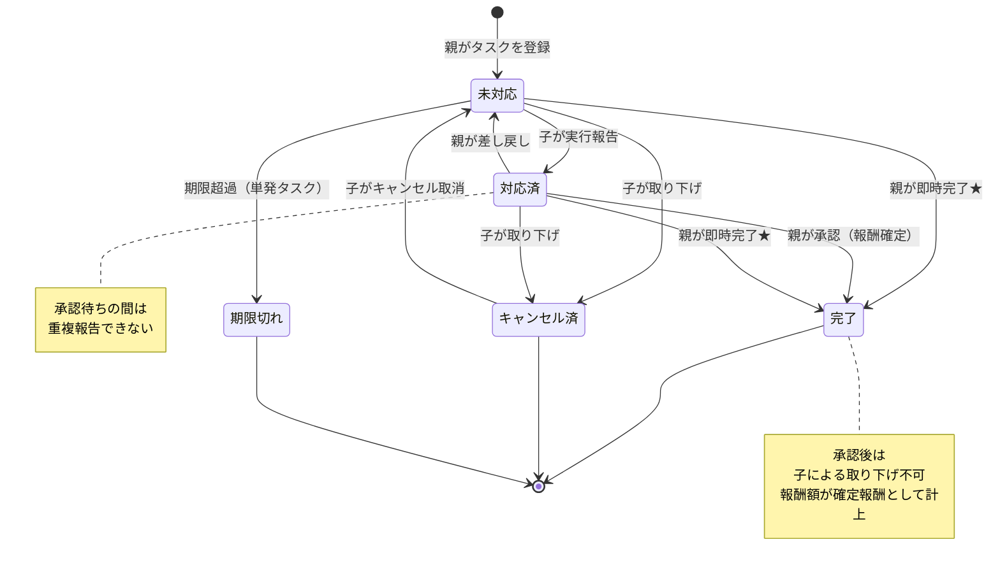

# タスクステータス遷移図（FamBiz）

## 概要

タスク（家事・お手伝い）が取り得るステータスと、その遷移条件を表した状態遷移図です。タスクは登録時に「未対応」となり、子の実行報告で「対応済」、親の承認で「完了」へ遷移します。親が差し戻すと「対応済」から「未対応」に戻り、子のキャンセルや期限切れによって終了状態に至る経路も持ちます。本図は業務要件定義書 6.3（ステータス遷移と承認に関するルール）に対応します。

## 図

## 補足

- 未対応：登録直後の初期状態。子の実行報告を待っている状態です。
- 対応済：子が実行を報告した状態。親の確認・承認待ちです。承認待ちの間の重複報告はできません。
- 完了：親が承認した最終状態。この時点で報酬額が「確定報酬」として計上され、子による取り下げはできなくなります。
- キャンセル済：親の承認前に子が取り下げた状態です。子はキャンセル取消操作で「未対応」に戻すことができます。
- 期限切れ：単発タスクが設定期限を過ぎ、自動的に報告不可となった終了状態です。
- 差し戻し（対応済 → 未対応）は、親が実績を承認せず再対応を求める場合の遷移です。
- ★ **即時完了**（未対応 → 完了 / 対応済 → 完了）：親がタスク編集画面の「既に完了にする」チェックボックスをオンにして更新した場合の特別遷移。子の実行報告ステップを省略できる。報酬は通常承認と同等に確定する。ただし当月（JST）の報酬が `paid` 済みの場合は実行できない（400 エラー）。`paid` 後の完了は当月にも翌月にも集計されないため操作自体をブロックする。
- **paid 済み月の承認制約**：当月（JST）の報酬が `paid` 済みの場合、通常の承認（対応済 → 完了）も実行できない（400 エラー）。`paid` 後に `approved_at` が設定された `task_completions` レコードは集計範囲外となり報酬に反映されないため、即時完了と同様に操作自体をブロックする。
