# ユースケース図（FamBiz）

## 概要

FamBiz プロトタイプ版における、利用者と機能の関係を表したユースケース図です。アクターは家庭内の利用者を表す「家族メンバー」と、その中で管理権限を持つ「保護者（親）」の2種類に整理しています。保護者は家族メンバーの一種であり、家族メンバーが行える操作に加えて、タスク・目標の登録や承認、月次評価といった管理系のユースケースを実行できます。本図はプロトタイプ対象画面（MVP）に対応するユースケースのみを記載し、本番のみ・リリース未定の機能（記事管理・お知らせ管理・通知・各種設定など）は除外しています。

## 図

```mermaid
flowchart TD
    %% アクター
    member(["👤 家族メンバー"])
    parent(["👤 保護者（親）"])

    %% 継承関係（保護者は家族メンバーの一種）
    parent -. 汎化 .-> member

    %% ユースケース群
    subgraph SYS["FamBiz（プロトタイプ）"]
        direction TB

        subgraph AUTH["認証・グループ"]
            UC01(["会員登録・ログインする"])
            UC02(["プロフィールを登録する"])
            UC03(["家族グループを作成する"])
            UC04(["家族メンバーを招待する（QR）"])
            UC05(["家族グループに参加する（QR）"])
            UC06(["家族メンバーを確認する"])
        end

        subgraph TASK["タスク（お手伝い）"]
            UC10(["タスクを登録する"])
            UC11(["タスクを確認する"])
            UC12(["タスクを実行報告する"])
            UC13(["タスクを承認・差し戻しする"])
            UC14(["タスクを検索する"])
        end

        subgraph GOAL["目標（マンスリーゴール）"]
            UC20(["今月の目標を登録する"])
            UC21(["今月の目標を確認する"])
            UC22(["今月の目標に挑戦する"])
            UC23(["目標達成を承認する"])
        end

        subgraph REWARD["報酬・評価"]
            UC30(["月次評価を登録する"])
            UC31(["報酬・評価を確認する"])
            UC32(["報酬グラフを確認する"])
        end
    end

    %% 家族メンバー（親子共通）が行えるユースケース
    member --- UC01
    member --- UC02
    member --- UC05
    member --- UC06
    member --- UC11
    member --- UC12
    member --- UC14
    member --- UC21
    member --- UC22
    member --- UC31
    member --- UC32

    %% 保護者（親）のみが行える管理系ユースケース
    parent --- UC03
    parent --- UC04
    parent --- UC10
    parent --- UC13
    parent --- UC20
    parent --- UC23
    parent --- UC30
```

## 補足

- 「保護者（親）」は「家族メンバー」を汎化（is-a）した存在として表現しています。実線は各アクターが直接実行するユースケース、点線（汎化）は保護者が家族メンバーの全ユースケースを継承することを示します。
- タスクの作成・編集・削除、承認・差し戻し、月次報酬の確定、目標設定・達成承認は業務ルール上「親のみ」が実行できる操作です（業務要件定義書 6.1）。
- タスクの実行報告や報酬履歴の閲覧、目標への挑戦は子（家族メンバー）側の操作です。
- 記事管理・お知らせ管理・通知・有料会員/退会などの管理系・本番限定機能はプロトタイプ範囲外のため本図から除外しています。
